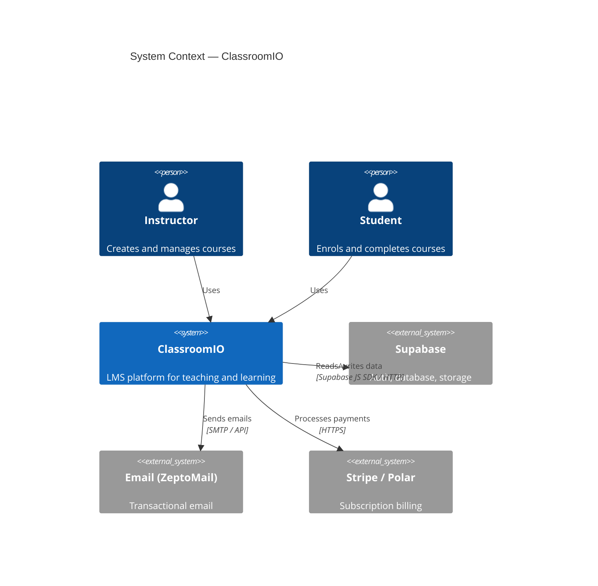
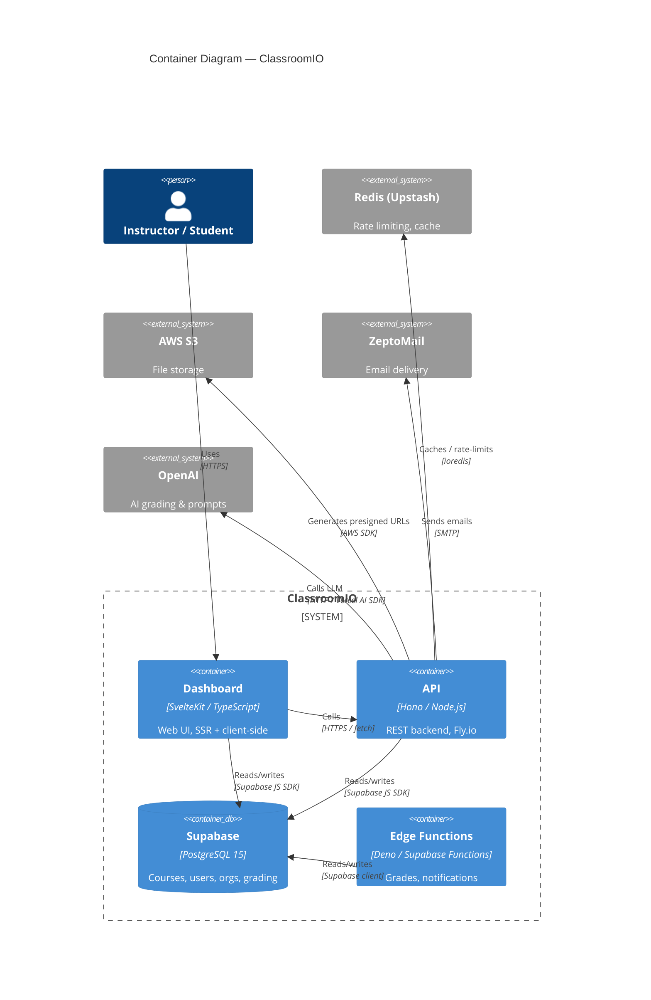
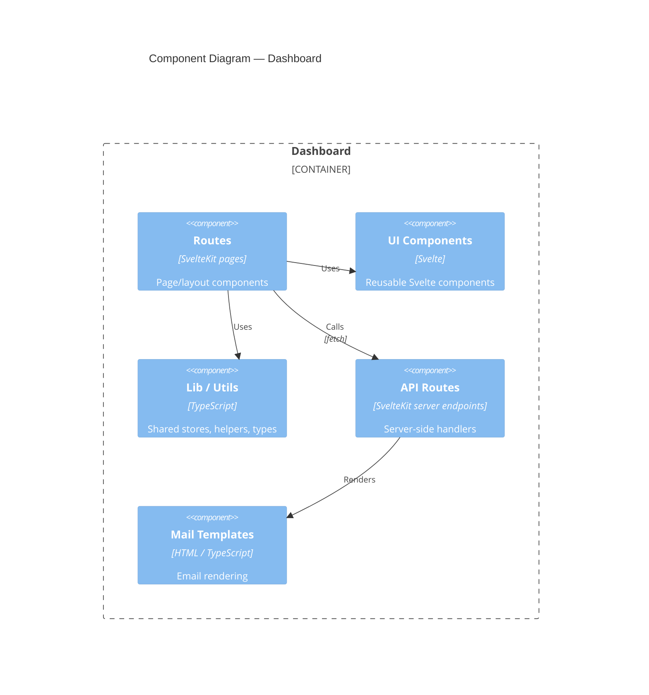

# Mermaid C4 Diagram Syntax

Source: https://mermaid.js.org/syntax/c4.html

> Note: Mermaid C4 support is experimental — syntax may change between releases.

## Diagram types

```
C4Context      — Layer 1: System Context
C4Container    — Layer 2: Container
C4Component    — Layer 3: Component
C4Dynamic      — Interaction / sequence (optional)
C4Deployment   — Infrastructure (optional)
```

## Layer 1 — System Context



## Layer 2 — Container



## Layer 3 — Component (template)



## Element reference

```
# People
Person(alias, label, description)
Person_Ext(alias, label, description)

# Systems
System(alias, label, description)
System_Ext(alias, label, description)
SystemDb(alias, label, description)       # database icon

# Containers
Container(alias, label, technology, description)
ContainerDb(alias, label, technology, description)
ContainerQueue(alias, label, technology, description)

# Components
Component(alias, label, technology, description)
ComponentDb(alias, label, technology, description)

# Boundaries
Enterprise_Boundary(alias, label) { ... }
System_Boundary(alias, label) { ... }
Container_Boundary(alias, label) { ... }

# Relationships
Rel(from, to, label)
Rel(from, to, label, technology)
BiRel(from, to, label)

# Layout hints (use sparingly)
Rel_R(from, to, label)   # force right
Rel_D(from, to, label)   # force down
```

## Styling (optional)

```
UpdateElementStyle(alias, $bgColor="#1168bd", $fontColor="#ffffff", $borderColor="#0e5da8")
UpdateRelStyle(from, to, $textColor="#999", $lineColor="#999", $offsetX="5", $offsetY="-10")
UpdateLayoutConfig($c4ShapeInRow="4", $c4BoundaryInRow="2")
```

## Tips for AI-readable output

- Keep diagrams to ≤ 20 nodes for readability.
- For L3, only show components with significant relationships.
- Use `Container_Boundary` to group related components visually.
- Prune self-obvious relationships (every route uses lib — omit if noise).
